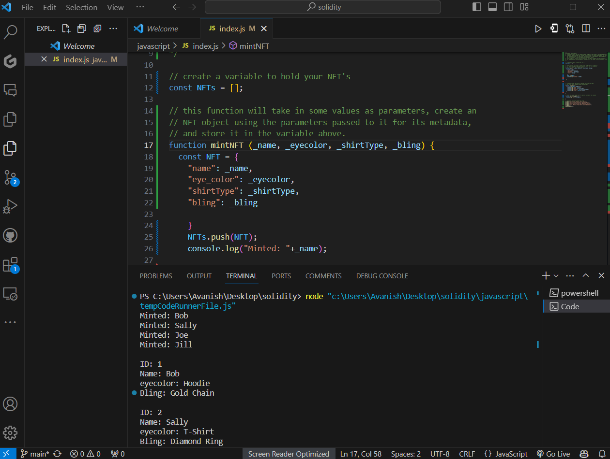

# NFT Creation and Metadata Printing in JavaScript

In this Code, I walk through the process of creating a variable that captures the number of entities and demonstrate
how to construct an object within the main NFT function. 
I delve into the various parameters and values employed in the NFT function,
showcasing how to output the metadata of the NFTs to the console.

## Key Highlights:

- **Variable Creation:** Learn how to create a variable that holds the count of entities.

- **Object Creation:** Explore the steps to create an object inside the main NFT function.

- **Parameter Explanation:** Understand the significance of different parameters and values used in the NFT function.

- **Console Output:** Witness the process of printing NFT metadata to the console.

- **Total NFT Length:** Gain insights into calculating the total length of the NFTs.

- **"List NFTs" Function:** I demonstrate how to call the "list NFTs" function effectively.

## Video Demo

[Watch my Explanation](https://www.loom.com/share/06a5531e02cc47999d2092f9e0ad0c38?sid=48bc8ad9-1cc1-42a1-b74c-89155b770611)

## OUTPUT

